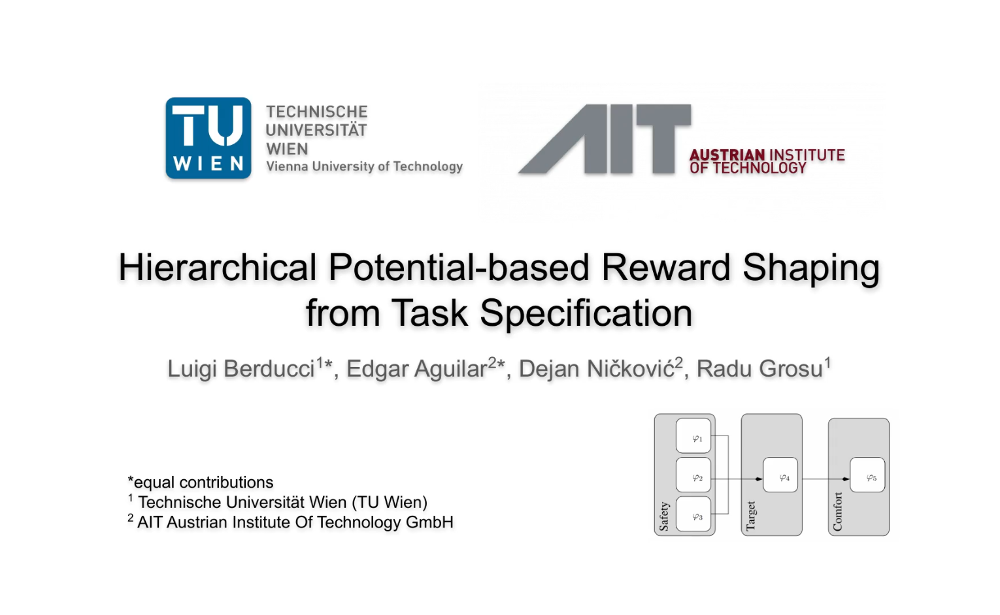

# Hierarchical Potential-based Reward Shaping

Experiments on automatic reward shaping from formal task specifications.

[](https://youtu.be/PWJxZEhlUj4)

Preprint available at [this link](https://arxiv.org/abs/2110.02792)

If you find this code useful, please reference in your paper:

```
@article{berducci2021hierarchical,
  title={Hierarchical Potential-based Reward Shaping from Task Specifications},
  author={Berducci, Luigi and Aguilar, Edgar A and Ni{\v{c}}kovi{\'c}, Dejan and Grosu, Radu},
  journal={arXiv e-prints},
  pages={arXiv--2110},
  year={2021}
}
```

## Installation 

We tested this implementation with `Python3.8` under `Ubuntu 20.04`.
To install the dependencies:

```pip install -r requirements.txt```

We assume you run the code from the project directory and that it is included in the `PYTHONPATH`.

### Docker image


In alternative to the previous step, 
we provide a docker-image with a working environment to reproduce this work.
You can either:
- pull the image from Dockerhub: `docker pull luigiberducci/reward_shaping:latest`
- or, build the image from scratch: `docker build -t reward_shaping .`

To run the container:

```
docker run --rm -it -u $(id -u):$(id -g) \
           -v $(pwd):/src --gpus all \
           <image-name> /bin/bash
```

Then, you can use any of the following scripts from within the container.

## Run training 

To train on the safe driving task in the `racecar` environment (for all the command line options, see `--help`):

```
python run_training.py --env racecar --task delta_drive \ 
                       --reward hprs --steps 1000000 --expdir my_exp
```

This command will start the training for `1M` steps 
using the reward `hprs` (Hierarchical Potential-based Reward Shaping).
The results will be stored in the directory `logs/racecar/my_exp`.


## Play with trained agents

The directory `checkpoints` contains a collection of trained agents for various environments.
For each environment, we report an agent trained with our `hprs` and an agent trained with the `default` shaped reward.
The performance of the various agents are comparable,
even if `hprs` is an automatic shaping methodology, 
while `default` is in most of the environment the result of an engineered shaping.

We provide the script `eval_trained_models.py` for playing with those.
To run:
```
python eval_trained_models.py --checkpoint checkpoints/bipedal_walker_hardcore_hrs.zip --n_episodes 10
```

This command will evaluate the given model for `10` episodes, 
and report mean and std dev of the Policy Assessment Metric described in the paper.

## Reproduce plot learning curves

Assuming to have reproduced the experiments and stored the logs into `logs/<env>` for each `<env>` of interest.
Then, you can reproduce the figure with learning curves with the script `plot_learning_curves.py`.
To run:

```
python plot_learning_curves.py  --logdir logs --gby env \ 
                                --regex **/*default* **/*tltl* \
                                        **/*bhnr* **/*morl_uni* \
                                        **/*morl_dec* **/*hprs_sac* \ 
                                --binning 100000 --hlines 1.5 --clipminy 0 -legend
```

## Request logs

If you do not have the compute resources to reproduce the experiments,
you can use the logs of our experiments, stored on Zenodo.

For any issue or request, feel free to contact us.

[](https://doi.org/10.5281/zenodo.7075333)

